---
title: "Multi-Agent Research System: Supervisor, Researcher, Analyst, Writer"
description: "XĂ¢y dá»±ng hệ thống nghiĂªn cứu multi-agent vá»›i LangGraph, so sĂ¡nh vá»›i single-agent baseline qua benchmark latency/cost/quality."
author: "VinUni Codelab"
duration: 240
category: "General"
updated: "2026-08-20"
day: "20"
sequence: 1
keywords: ["AI", "Multi-Agent", "LangGraph", "LLM", "Agents", "Benchmark"]
level: "intermediate"
requiresSubmission: true
workMode: "individual"
overview:
  summary: "Bạn sẽ xĂ¢y dá»±ng má»™t research assistant gồm nhiều agent (Supervisor Ä‘iều phối Researcher, Analyst, Writer) trĂªn nền LangGraph, sau Ä‘Ă³ benchmark hệ thống nĂ y vá»›i má»™t single-agent baseline để trả lời cĂ¢u hỏi: khi nĂ o multi-agent thá»±c sá»± Ä‘Ă¡ng dĂ¹ng?"
  knowledge:
    - "Python cơ bản (function, class, type hints)"
    - "ÄĂ£ từng gọi LLM API (OpenAI hoặc tÆ°Æ¡ng Ä‘Æ°Æ¡ng)"
    - "Hiểu khĂ¡i niệm prompt vĂ  structured output"
    - "Biết dĂ¹ng git, terminal, virtualenv"
  conceptFlow:
    - "Single-agent baseline: má»™t agent lĂ m tất cả — nhanh nhÆ°ng dá»… loĂ£ng context"
    - "TĂ¡ch vai trĂ²: Researcher tìm nguồn, Analyst phĂ¢n tĂ­ch, Writer tổng hợp"
    - "Supervisor/Router: quyết định gọi agent nĂ o, khi nĂ o dừng"
    - "Shared state: nguồn thĂ´ng tin duy nhất truyền qua cĂ¡c agent"
    - "Guardrails: max iterations, timeout, retry để agent khĂ´ng chạy vĂ´ hạn"
    - "Trace + Benchmark: Ä‘o latency/cost/quality thay vì nhìn output bằng cảm tĂ­nh"
  phases:
    - time: "0-30'"
      owner: "Học viĂªn"
      title: "Setup & Baseline"
      description: "CĂ i mĂ´i trường, chạy skeleton, implement LLM client vĂ  single-agent baseline."
    - time: "30-90'"
      owner: "Học viĂªn"
      title: "Supervisor & Workflow"
      description: "Implement routing policy trong Supervisor vĂ  build LangGraph workflow vá»›i stop condition."
    - time: "90-150'"
      owner: "Học viĂªn"
      title: "Worker Agents"
      description: "Implement Researcher (search), Analyst (phĂ¢n tĂ­ch), Writer (tổng hợp) vá»›i shared state."
    - time: "150-210'"
      owner: "Học viĂªn"
      title: "Trace & Benchmark"
      description: "Gắn tracing (LangSmith/Langfuse), chạy benchmark single vs multi-agent, viết report."
    - time: "210-240'"
      owner: "Cả lớp"
      title: "Peer Review & Exit Ticket"
      description: "Review chĂ©o theo rubric, trả lời cĂ¢u hỏi khi nĂ o nĂªn/khĂ´ng nĂªn dĂ¹ng multi-agent."
  outcomes:
    - "Thiết kế được role rõ rĂ ng cho nhiều agent, khĂ´ng overlap"
    - "XĂ¢y dá»±ng shared state đủ thĂ´ng tin cho handoff giữa cĂ¡c agent"
    - "ThĂªm guardrail tối thiểu: max iterations, timeout, retry/fallback, validation"
    - "Trace được luồng chạy vĂ  giải thĂ­ch agent nĂ o lĂ m gì, tốn bao nhiĂªu"
    - "Benchmark single-agent vs multi-agent theo quality, latency, cost"
  reassurance: "Starter repo Ä‘Ă£ cĂ³ sẵn khung production-grade (config, schema, test, CI). Bạn chỉ cần Ä‘iền logic vĂ o cĂ¡c Ä‘iểm IMPLEMENTED — má»—i Ä‘iểm đều cĂ³ docstring hÆ°á»›ng dẫn, vĂ  test sẽ bĂ¡o rõ khi bạn hoĂ n thĂ nh Ä‘Ăºng."
---

## Kiến trĂºc tổng thể

Hai cĂ¡ch lĂ m bạn sẽ so sĂ¡nh trong lab:



Luồng má»™t lần chạy multi-agent Ä‘iển hình (shared state chuyền qua từng bÆ°á»›c):



## 1. Thuật ngữ cần biết

| Thuật ngữ gốc | Bản chất khĂ¡i niệm | Minh hoạ trá»±c quan |
| --- | --- | --- |
| Agent | Má»™t "nhĂ¢n viĂªn" LLM cĂ³ vai trĂ², prompt vĂ  cĂ´ng cụ riĂªng, nhận input từ state vĂ  trả output cĂ³ cấu trĂºc | Researcher nhÆ° thá»±c tập sinh chuyĂªn Ä‘i tìm tĂ i liệu; Writer nhÆ° biĂªn tập viĂªn chỉ lo viết |
| Supervisor / Router | Agent Ä‘iều phối: nhìn state hiện tại vĂ  quyết định bÆ°á»›c tiếp theo lĂ  gọi ai hoặc dừng | Trưởng nhĂ³m đứng bảng phĂ¢n cĂ´ng: "chÆ°a cĂ³ nguồn → gọi Researcher; đủ phĂ¢n tĂ­ch → gọi Writer" |
| Shared state | Cấu trĂºc dữ liệu duy nhất được truyền qua mọi agent, chứa toĂ n bá»™ ngữ cảnh của phiĂªn lĂ m việc | Tờ hồ sÆ¡ vụ việc chuyền tay trong văn phĂ²ng — ai lĂ m xong phần mình thì ghi thĂªm vĂ o |
| Handoff | Việc má»™t agent hoĂ n thĂ nh vĂ  chuyển quyền xá»­ lĂ½ (kèm state) cho agent khĂ¡c | Researcher ná»™p `research_notes` vĂ o hồ sÆ¡ rồi chuyển bĂ n cho Analyst |
| LangGraph | Framework xĂ¢y workflow dạng đồ thị: node lĂ  agent, edge lĂ  luồng chuyển, cĂ³ conditional routing | SÆ¡ đồ dĂ¢y chuyền sản xuất: má»—i trạm má»™t việc, cĂ³ nhĂ¡nh rẽ tĂ¹y tình trạng sản phẩm |
| Guardrail | CÆ¡ chế chặn agent chạy sai/vĂ´ hạn: max iterations, timeout, retry, validation | Cầu dao tá»± ngắt — vĂ²ng lặp Supervisor↔Researcher quĂ¡ 6 lần thì hệ thống dừng, khĂ´ng đốt token vĂ´ Ă­ch |
| Trace | Bản ghi từng bÆ°á»›c chạy: agent nĂ o được gọi, input/output gì, tốn bao nhiĂªu token/thời gian | Há»™p Ä‘en mĂ¡y bay — khi kết quả sai, mở trace ra xem sai từ bÆ°á»›c nĂ o |
| Benchmark | So sĂ¡nh cĂ³ số liệu giữa cĂ¡c cĂ¡ch lĂ m (latency, cost, quality) thay vì cảm tĂ­nh | Đua hai Ä‘á»™i cĂ¹ng đề bĂ i, chấm bằng đồng hồ + hĂ³a Ä‘Æ¡n token + rubric, khĂ´ng chấm bằng "trĂ´ng cĂ³ vẻ hay" |

## 2. Mục tiĂªu & đầu ra

Bạn hoĂ n thĂ nh khi:

1. `python -m multi_agent_research_lab.cli baseline --query "..."` trả về cĂ¢u trả lời thật từ LLM (khĂ´ng cĂ²n placeholder).
2. `python -m multi_agent_research_lab.cli multi-agent --query "..."` chạy hết workflow Supervisor → Researcher → Analyst → Writer vĂ  in ra `final_answer` kèm `route_history`.
3. CĂ³ trace xem được (LangSmith/Langfuse screenshot hoặc link) cho Ă­t nhất 1 lần chạy multi-agent.
4. CĂ³ file `reports/benchmark_report.md` so sĂ¡nh single vs multi-agent vá»›i Ă­t nhất 3 metric: latency, cost, quality.
5. `make lint` vĂ  `make test` pass; khĂ´ng cĂ²n `implementation marker` khi chạy cĂ¡c lệnh trĂªn.

## 3. Chuẩn bị

**CĂ´ng cụ:**

- Python 3.11+ (khuyến nghị 3.12), `git`, terminal (macOS/Linux/WSL).
- Editor cĂ³ Python support (VS Code / Kiro / PyCharm).

**API keys (điền vào `.env`):**

- `OPENAI_API_KEY` — bắt buộc (hoặc provider tương đương, tự điều chỉnh `llm_client.py`).
- `TAVILY_API_KEY` — tĂ¹y chọn; nếu khĂ´ng cĂ³, implement mock search trong `services/search_client.py`.
- `LANGSMITH_API_KEY` hoặc `LANGFUSE_*` — tĂ¹y chọn cho tracing (khuyến nghị cĂ³ Ă­t nhất má»™t).

**Setup mĂ´i trường:**

```bash
git clone https://github.com/VinUni-AI20k/VinUni-AI20k-K3-Track3-Lab20-MultiAgent.git
cd VinUni-AI20k-K3-Track3-Lab20-MultiAgent
python -m venv .venv && source .venv/bin/activate
pip install -e ".[dev,llm]"
cp .env.example .env   # rồi điền API keys
make test              # 4 tests phải pass ngay từ đầu
```

> **macOS lÆ°u Ă½:** nếu gặp `SSLCertVerificationError` khi gọi API, xem mục Troubleshooting trong `docs/lab_guide.md` (fix bằng `certifi` hoặc `Install Certificates.command`).

## 4. Thá»±c hĂ nh

Tìm toĂ n bá»™ Ä‘iểm cần lĂ m bằng: `grep -R "IMPLEMENTED" -n src tests docs`

### Bước 1 — LLM client & Baseline (0-30')

- Implement `services/llm_client.py`: gọi LLM thật, trả structured output.
- Sửa command `baseline` trong `cli.py`: thay placeholder bằng một call LLM end-to-end.
- **Kết quả mong đợi:** chạy `make run-baseline` in ra cĂ¢u trả lời thật, ghi lại latency vĂ  token usage để so sĂ¡nh sau.

### Bước 2 — Supervisor & Workflow (30-90')

- Implement routing policy trong `agents/supervisor.py`: dá»±a vĂ o state (Ä‘Ă£ cĂ³ `sources`? Ä‘Ă£ cĂ³ `analysis_notes`?) để quyết định route tiếp theo.
- Implement `graph/workflow.py`: build LangGraph vá»›i cĂ¡c node supervisor/researcher/analyst/writer, conditional edges, vĂ  stop condition (dĂ¹ng `max_iterations` từ config).
- **Kết quả mong đợi:** `make run-multi` khĂ´ng cĂ²n bĂ¡o `implementation marker` ở workflow; `route_history` trong output thể hiện Ä‘Ăºng thứ tá»± routing.

### Bước 3 — Worker agents (90-150')

- `agents/researcher.py`: gọi `SearchClient` (Tavily hoặc mock), ghi `sources` + `research_notes` vĂ o state.
- `agents/analyst.py`: đọc `research_notes`, sinh `analysis_notes` (so sĂ¡nh, Ä‘Ă¡nh giĂ¡ Ä‘á»™ tin cậy nguồn).
- `agents/writer.py`: tổng hợp thĂ nh `final_answer` cĂ³ citation trỏ về `sources`.
- **Kết quả mong đợi:** chạy end-to-end ra `final_answer` cĂ³ trĂ­ch dẫn; state chứa đủ dữ liệu trung gian để debug.

### Bước 4 — Trace & Benchmark (150-210')

- Implement `observability/tracing.py` với LangSmith/Langfuse (hoặc OpenTelemetry).
- Implement `evaluation/benchmark.py` + `evaluation/report.py`: chạy cĂ¹ng bá»™ query qua cả baseline vĂ  multi-agent, Ä‘o latency/cost/quality/citation coverage/failure rate.
- Viết `reports/benchmark_report.md`.
- **Kết quả mong đợi:** mở được trace UI thấy từng agent step; report cĂ³ bảng số liệu so sĂ¡nh vĂ  1 Ä‘oạn phĂ¢n tĂ­ch failure mode.

### Bước 5 — Peer review & Exit ticket (210-240')

- Review chĂ©o theo `docs/peer_review_rubric.md` (5 tiĂªu chĂ­ Ă— 0-2 Ä‘iểm).
- Trả lời exit ticket trong `docs/lab_guide.md`: case nĂ o nĂªn / khĂ´ng nĂªn dĂ¹ng multi-agent, vì sao.

## 5. Kiểm tra kết quả

**Tự kiểm tra:**

```bash
make lint        # ruff: phải "All checks passed!"
make test        # pytest: tất cả pass
make run-baseline
make run-multi   # khĂ´ng cĂ²n panel "Expected TODO"
grep -R "IMPLEMENTED" -n src | wc -l   # cĂ¡c TODO cốt lõi Ä‘Ă£ được thay bằng implementation
```

**Lỗi thường gặp:**

| Lá»—i | NguyĂªn nhĂ¢n | CĂ¡ch xá»­ lĂ½ |
| --- | --- | --- |
| `implementation marker: implement MultiAgentWorkflow.run` | ChÆ°a implement workflow — Ä‘Ă¢y lĂ  hĂ nh vi mặc định của starter | LĂ m BÆ°á»›c 2 |
| `SSLCertVerificationError` trĂªn macOS | Python khĂ´ng tìm thấy CA bundle của hệ Ä‘iều hĂ nh | Xem Troubleshooting trong `docs/lab_guide.md`: dĂ¹ng `certifi` hoặc chạy `Install Certificates.command` |
| Workflow lặp vĂ´ hạn Supervisor ↔ Researcher | Thiếu stop condition / khĂ´ng tăng `iteration` | DĂ¹ng `state.record_route()` vĂ  check `max_iterations` từ `Settings` |
| `401 Unauthorized` khi gọi LLM | ChÆ°a Ä‘iền key vĂ o `.env` hoặc chÆ°a `cp .env.example .env` | Kiểm tra `.env`, khĂ´ng hard-code key trong code |
| Output multi-agent kĂ©m hÆ¡n baseline | Bình thường! Multi-agent khĂ´ng phải lĂºc nĂ o cÅ©ng thắng | Ghi nhận vĂ o benchmark report vĂ  phĂ¢n tĂ­ch trade-off — Ä‘Ă¢y chĂ­nh lĂ  learning outcome |

## 6. Ná»™p bĂ i

Artefact cần nộp:

1. **Link GitHub repo cĂ¡ nhĂ¢n** — code hoĂ n chỉnh, `make lint` + `make test` pass, khĂ´ng cĂ²n `implementation marker` ở luồng chĂ­nh.
2. **Trace evidence** — screenshot hoặc link LangSmith/Langfuse của Ă­t nhất 1 lần chạy multi-agent end-to-end.
3. **`reports/benchmark_report.md`** — bảng so sĂ¡nh single vs multi-agent (tối thiểu: latency, cost, quality) + 1 Ä‘oạn giải thĂ­ch failure mode gặp phải vĂ  cĂ¡ch fix.
4. **Exit ticket** — trả lời 2 cĂ¢u hỏi trong `docs/lab_guide.md` (khi nĂ o nĂªn / khĂ´ng nĂªn dĂ¹ng multi-agent).
